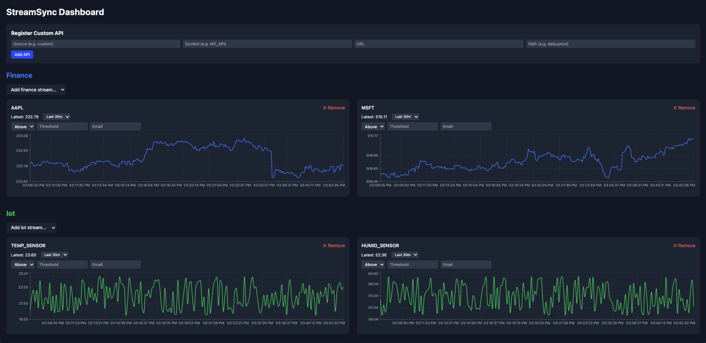

# StreamSync: Real-Time Multi-Source Dashboard

**StreamSync** is a full-stack real-time dashboard for monitoring and visualizing live data streams.  
It supports finance (stocks/crypto), IoT sensors, weather data, system metrics, and even **custom APIs** that users can register on the fly.  

The project is fully containerized with **Docker Compose**, uses **PostgreSQL** for historical persistence, and provides **threshold-based alerts with email notifications**.

---

## Features

- **Real-Time Streaming**  
  Live updates via WebSockets for finance, IoT, weather, and system data.

- **Historical Persistence**  
  Data stored in PostgreSQL; users can select ranges (30m, 1h, 12h, 24h, 3d, 7d).

- **Custom API Integration**  
  Users can register arbitrary REST endpoints with a JSON path, and the dashboard auto-visualizes them.

- **Threshold Alerts + Email Notifications**  
  Define rules like “AAPL above 200” or “CPU load above 80%” and get notified instantly via toast and email.

- **Dynamic Dashboard**  
  Add/remove charts by category; charts are color-coded.

- **Dockerized Stack**  
  One command (`docker compose up`) runs the entire stack: backend, frontend, and database.

---

## Tech Stack

- **Frontend**: React, TypeScript, TailwindCSS, Recharts, Socket.IO Client  
- **Backend**: Node.js, Express, Socket.IO, PostgreSQL, Yahoo Finance API, Nodemailer  
- **Database**: PostgreSQL (with persistence across containers)  
- **Infrastructure**: Docker, Docker Compose  

---

## Setup Instructions

### 1. Clone the repo
```bash
git clone https://github.com/<your-username>/streamsync.git
cd streamsync
```

### 2. Add Environment Variables
Create a `.env` file in the **backend** folder:

```bash
# Database
PGUSER=postgres
PGPASSWORD=password
PGDATABASE=streamsync
PGHOST=db
PGPORT=5432

# Email (for alerts)
EMAIL_USER=youremail@gmail.com
EMAIL_PASS=your-app-password
```

Do **not** commit `.env` to GitHub — it’s already in `.gitignore`.

### 3. Run with Docker Compose
```bash
docker compose up --build
```

- Frontend → http://localhost:5173  
- Backend API → http://localhost:4000  
- Database → localhost:5432  

### 4. Usage
- Default categories: Finance (AAPL, MSFT, GOOG, BTC, ETH), IoT, Weather, System metrics.  
- Register your own API from the **“Register Custom API”** form in the dashboard.  
- Set alerts → get toast + email notifications.  

---

## Screenshots



---

## Future Work
- User authentication (per-user dashboards, saved layouts).  
- Drag-and-drop dashboard customization.  
- Cloud deployment (AWS ECS / RDS / S3).  
- Advanced visualizations (candlestick, gauges, anomaly detection).  
- Machine learning integrations (forecasting, anomaly alerts).  

---

## License
MIT License © 2025 Jeffery Wei

---

## ✨ Credits
Built by [Jeffery Wei](https://jefferywei.com) — Computer Science & Applied Math @ UMD.